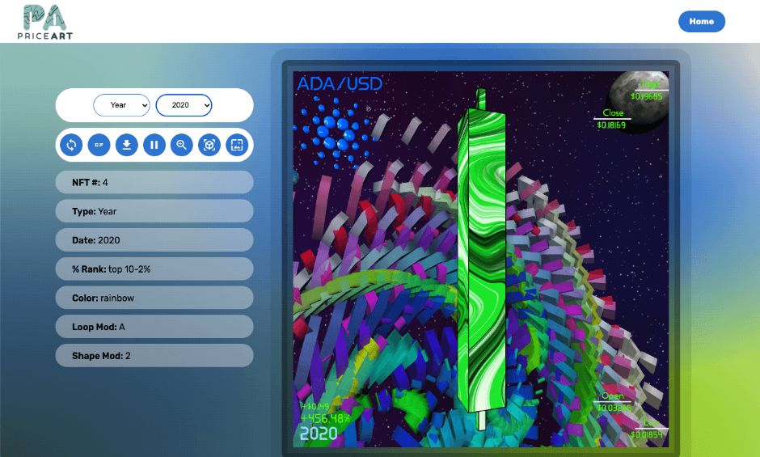

# ADA-PriceArt-explorer
10,068 generative art NFTs minted on the Cardano blockchain, showcasing the price movement of the ADA/USD pair from 2017 to 2021. 

This project took me several months to complete, and was an incredible learning journey for me as a developer. I used historical OHLC data from four different timeframes (year, month, week, day and 4-hour) as the data source for each NFT. There are were 4 year NFTs, 47 month NFTs, 205 week NFTs, 1431 day NFTs, and 8581 4-hour NFTs to make a total of 10,068. Each time frame has a different generative art graphic, and generally increases in visual complexity as rarity increases. Each NFT came with a static image, overview of the stats for the time period, and an interactive custom website hosted on IPFS. The code for the sites themselves can be found on my GitHub profile. A good amount of these were minted, but the project wasn't as successful as I hoped it be. Though the learning from this project was worth the price of admission!

This code is not particularly well organized, or nor is it 'clean code' per se. I was a newbie dev trying to code his own NFT project lol. It was a wonderful learning project for me and I am still proud of how well it works despite being such a chaotic code base. Lots of lessons learned here. 

*If you want to fork this and play with it, feel free to! And let me know if you need help with the code.*
